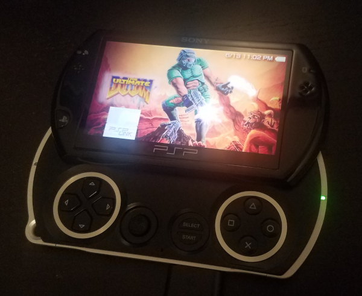
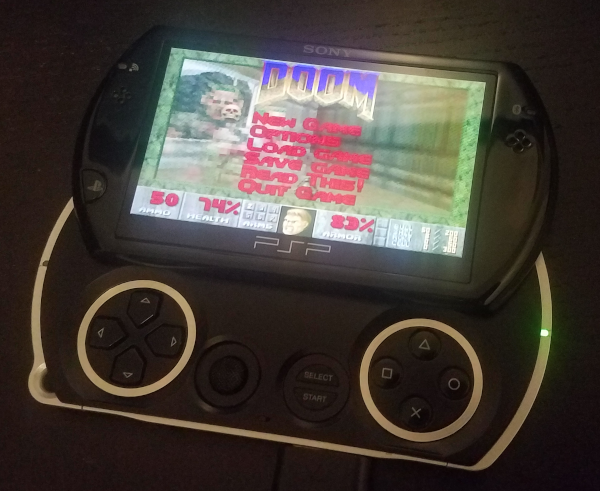

# Chocolate Doom PSP

A simple port of Doom for the Sony PSP.




## Motivation

Doom is one of the most widely ported games there is and there are even
many PSP ports that already exist. The purpose of this project was not to
reinvent the wheel, but to work with a codebase that is known to be extremely
portable for the purposes of learning more about the porting process.

A project like this is small and allows me to learn and solve the various
challenges that arise when porting _any_ game to the PSP (or other platforms, to
some extent). The skills learned are directly transferrable. Because of this, work
on future game ports will consist entirely of overcoming game-specific challenges
rather than getting hung up on the common issues that come with the territory.

## Prerequisites
* You will need a PSP capable of running unsigned code. There are many
  [guides](https://wololo.net/cfw4dummies) available on how to install custom
  firmware. Alternately, you can [sign](https://github.com/int-0/ebootsigner)
  your executable so it will run on an unmodified PSP. This port also works in
  [PSP emulators](https://www.ppsspp.org/).

## Compiling

* Install the [PSP toolchain](https://github.com/pspdev/psptoolchain)
* Build [SDL2](https://hg.libsdl.org/SDL/), [SDL2_mixer](https://hg.libsdl.org/SDL_mixer/),
  and [SDL2_net](https://hg.libsdl.org/SDL_net/) using the PSP toolchain (only SDL2 has a
  PSP Makefile, you will need to write your own for SDL2_mixer and SDL2_net)
* Use my [PSP CMake toolchain file](https://gist.github.com/mwpenny/00c51d3c2a45c4ec0002ef8645efc09d)
  to generate a Makefile for Chocolate Doom
* Build Chocolate Doom for PSP by running `make chocolate-doom`

## Running

* On your PSP, create a directory at `ms0:/PSP/GAME/DOOM` and copy `EBOOT.PBP` and a
  Doom WAD file to that location
* Navigate to the game using the PSP XMB menu and start it

## PSP controls

* D-pad/joystick: movement
* Cross: fire
* Circle: use
* Square/Triangle: Next/previous weapon
* L/R: Strafe
* Start: Menu
* Select: Automap

## Limitations

* No sound. It works but I have disabled it since every time a new (uncached) sound loads,
  the game freezes for several seconds. An improvement could be to cache them all on startup
  but it cannot be done naively due to memory constraints.


# Chocolate Doom

Chocolate Doom aims to accurately reproduce the original DOS version of
Doom and other games based on the Doom engine in a form that can be
run on modern computers.

Originally, Chocolate Doom was only a Doom source port. The project
now includes ports of Heretic and Hexen, and Strife.

Chocolate Doom’s aims are:

 * To always be 100% Free and Open Source software.
 * Portability to as many different operating systems as possible.
 * Accurate reproduction of the original DOS versions of the games,
   including bugs.
 * Compatibility with the DOS demo, configuration and savegame files.
 * To provide an accurate retro “feel” (display and input should
   behave the same).

More information about the philosophy and design behind Chocolate Doom
can be found in the PHILOSOPHY file distributed with the source code.

## Setting up gameplay

For instructions on how to set up Chocolate Doom for play, see the
INSTALL file.

## Configuration File

Chocolate Doom is compatible with the DOS Doom configuration file
(normally named `default.cfg`). Existing configuration files for DOS
Doom should therefore simply work out of the box. However, Chocolate
Doom also provides some extra settings. These are stored in a
separate file named `chocolate-doom.cfg`.

The configuration can be edited using the chocolate-setup tool.

## Command line options

Chocolate Doom supports a number of command line parameters, including
some extras that were not originally suported by the DOS versions. For
binary distributions, see the CMDLINE file included with your
download; more information is also available on the Chocolate Doom
website.

## Playing TCs

With Vanilla Doom there is no way to include sprites in PWAD files.
Chocolate Doom’s ‘-file’ command line option behaves exactly the same
as Vanilla Doom, and trying to play TCs by adding the WAD files using
‘-file’ will not work.

Many Total Conversions (TCs) are distributed as a PWAD file which must
be merged into the main IWAD. Typically a copy of DEUSF.EXE is
included which performs this merge. Chocolate Doom includes a new
option, ‘-merge’, which will simulate this merge. Essentially, the
WAD directory is merged in memory, removing the need to modify the
IWAD on disk.

To play TCs using Chocolate Doom, run like this:

```
chocolate-doom -merge thetc.wad
```

Here are some examples:

```
chocolate-doom -merge batman.wad -deh batman.deh vbatman.deh  (Batman Doom)
chocolate-doom -merge aoddoom1.wad -deh aoddoom1.deh  (Army of Darkness Doom)
```

## Other information

 * Chocolate Doom includes a number of different options for music
   playback. See the README.Music file for more details.

 * More information, including information about how to play various
   classic TCs, is available on the Chocolate Doom website:

     https://www.chocolate-doom.org/

   You are encouraged to sign up and contribute any useful information
   you may have regarding the port!

 * Chocolate Doom is not perfect. Although it aims to accurately
   emulate and reproduce the DOS executables, some behavior can be very
   difficult to reproduce. Because of the nature of the project, you
   may also encounter Vanilla Doom bugs; these are intentionally
   present; see the NOT-BUGS file for more information.

   New bug reports can be submitted to the issue tracker on Github:

     https://github.com/chocolate-doom/chocolate-doom/issues

 * Source code patches are welcome, but please follow the style
   guidelines - see the file named HACKING included with the source
   distribution.

 * Chocolate Doom is distributed under the GNU GPL. See the COPYING
   file for more information.

 * Please send any feedback, questions or suggestions to
   chocolate-doom-dev-list@chocolate-doom.org. Thanks!
